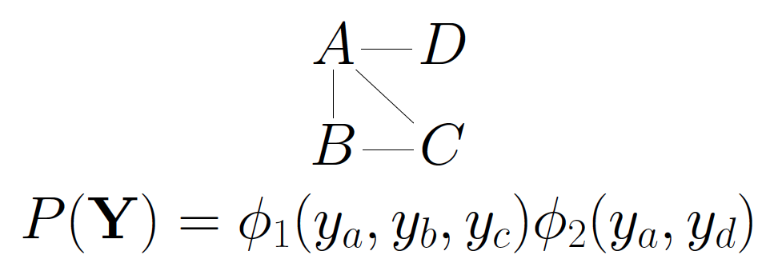

## Graphical models to learn about co-expression
There are number of good reasons to go to the trouble and expensive of isolating single cells to study gene expression in them.
The inference of patterns of association, and perhaps ultimately cause and effect is one of them. 
Markov graphical models have been a popular method to describe association relationships between genes in bulk gene expression experiments.
Each gene is a node in a graph, and the absence of an edge connecting
two indicates an absence of a regulatory
link.^[More precisely, a conditional independence in expression.]

<br>

<br>
A graph and its probability distribution. C directly affects A, but not D.

Bulk gene expression experiments relied on aggregations of thousands of cells to measure the average expression in an organism.
Advances in microfluidic and droplet sequencing now permit expression profiling in single cells.
This study of cell-to-cell variation reveals that individual cells lack detectable expression of transcripts that appear abundant on a population level, giving rise to zero-inflated expression patterns.

### Single cell expression is deconvolved but noisy
A typical cell contains 1-50 picograms of total RNA, of which perhaps 5\% is assayable messenger RNA encoding for proteins (the remainder is structural tRNA and rRNA).
Protocols for bulk gene expression experiments, such as for Illumina TrueSeq, may call for 100 nanograms of total mRNA, hence require the equivalent of 80,000 cells' worth of mRNA.  
On the one hand, this biological ``summation'' over thousands of cells is expected to yield sharper inference on the mean expression level of each gene.
However, this comes at the cost of distorting the conditional dependences present between genes.  

Consider $\mathbf{Y}_{i}$, an \emph{iid} sequence of random vectors in $\mathbb{R}^p$ representing the copy number of $p$ transcripts present in single cells $i=1,\dotsc,n$.
Now suppose the $n$ cells are aggregated and the total expression is measured using some linear quantification that reports values proportional to the input counts of mRNA.
Then the sum of expression observed in \emph{bulk} experiments is
\[
\mathbf{Z} = \sum_i^n \mathbf{Y}_i.
\]

If the distribution of $\mathbf{Y}_i$ obeys some conditional independence relationships, in general the distribution of $\mathbf{Z}$ does not obey these same relationships.  
For example, take $p=3$ and suppose that $\mathbf{Y}_i$  are \emph{iid} samples from a tri-variate distribution $[Y_1, Y_2, Y_3]$ on $\left\{0,  1 \right\}^3$.  Suppose the probability mass function (PMF) factors as $p(y_1, y_2, y_3) = p(y_1) p(y_2|y_1) p(y_3|y_2)$, that is $Y_1$ and $Y_3$ are conditionally independent given $Y_2$, or in symbols $Y_1 \perp Y_3 | Y_2$.  
Then $p(y_3, y_2|y_1) = p(y_2|y_1) p(y_3|y_2)$, which is equivalent to saying that each $2\times2$ probability table $p(y_3, y_2|y_1=j)$, $j=0,1$ has non-negative rank one.  
Yet even summing over $n=2$ cells, the PMF of $\mathbf Z = \mathbf{Y_1} +\mathbf{ Y_2}$ will not generally factor as such, as one may exhibit a $3 \times 3$ probability table for $p(z_3, z_2 | z_1)$. 

For example, here we simulate variables following a multivariate hurdle model (see next section) that obey the above conditional independence relationship.
The values in `y` could represent expression found in single cells.
```{r}
library(HurdleNormal)
library(GGally)
library(ggplot2)
G = matrix(c(-16, 2, 0,
             2, -17, 2,
             0, 2, -16), nrow=3)
H = matrix(c(5, 0, 0,
             0, 5, 0,
             0, 0, 5), nrow=3)
K = diag(1, nrow=3)
y = as.data.frame(rGibbsHurdle(G, H, K, 301000, thin = .01, burnin=1000))
ggpairs(y, upper=list(continuous=ggally_hurdle), lower=list(continuous=ggally_hmosaic))
testBinaryIndependence = function(ydat, x0,r){
    yprime = with(ydat, data.frame(A1=(abs(V1-x0)<r)*1, A2=(abs(V2-x0)<r)*1, A3=(abs(V3-x0)<r)*1))
    fit = glm( A1 ~A2 + A3, data=yprime, family='binomial')
    message('z scores')
    coef(fit)/sqrt(diag(vcov(fit)))
}

testBinaryIndependence(y[seq(1, nrow(y), by=2),], x0=5, r=3)
```
When we fit an appropriate log-linear model^[Here we test that the events $A_1 \perp A_2 | A_3$ where $A_i$ is the event that $Y_i$ lies in some interval, which of course is only a necessary condition for $Y_1 \perp Y_2 | Y_3$ but not sufficient.], we find that the `A3` coefficient is not significantly different from zero, while `A2` is, implying the model  $Y_1 \perp Y_3 | Y_2$.
When we take the convolution that sums pairs of observations, independence no longer holds.
```{r}
z = y[seq(1, nrow(y), by=4),] + y[seq(2, nrow(y), by=4),] + y[seq(3, nrow(y), by=4),] +  y[seq(4, nrow(y), by=4),]
ggpairs(z, upper=list(continuous=ggally_hurdle), lower=list(continuous=ggally_hmosaic))
testBinaryIndependence(z, x0=10, r=5)
```


The infamous case in which graphical structure commutes under convolution is when the $\mathbf{Y}_i$ are multivariate Normal. 
But single cell gene expression is zero-inflated, and not plausibly described by a multivariate Normal distribution.   

## An example of fitting the network
```{r}
library(stringr)
data(shalek2014)
set.seed(1234)

logExpression1h = t(shalek2014_list$exprs)
##ggpairs doesn't like non-syntactic colnames
colnames(logExpression1h) <- make.names(colnames(logExpression1h))
allgenes <- colnames(logExpression1h)
genes <- c('MGL2', 'MX1', str_subset(allgenes, '^H2[.]'), sample(allgenes, 30))
ggpairs(as.data.frame(logExpression1h[,c('MGL2', 'MX1', 'H2.AA')]),upper=list(continuous=ggally_hurdle), lower=list(continuous=ggally_hmosaic))
```

The data, originally published in [Shalek, et al 2014](http://www.nature.com/doifinder/10.1038/nature13437), are already thresholded using [MAST](http://bioconductor.org/packages/release/bioc/html/MAST.html).
We consider the subset of the data collected post one hour stimulation
with LPS.


```{r}
exp1h_trans <- conditionalCenter(logExpression1h)
ggpairs(as.data.frame(exp1h_trans[,c('MGL2', 'MX1', 'H2.AA')]),upper=list(continuous=ggally_hurdle), lower=list(continuous=ggally_hmosaic))
```

Conditionally centering the non-zero values in the data makes the discrete and continuous
components orthogonal.
This does change the problem slightly, but improves the geometry of
the log-likelihood, significantly speeding convergence.


The edges are discovered by fitting a vector regression model gene by gene.
Because it is a regression, it's easy to add covariates.
In this case, we adjust for the cellular detection rate.
```{r, results='hide', message = FALSE, warning = FALSE}
## options(mc.cores=4) #or however many your system has
covariates = cbind(1, scale(shalek2014_list$cdata$
                                        ngeneson))
## Only fits a subset of genes so that the vignette compiles in a reasonable fashion
## See also "subset" to enable parallization across a cluster
hurdle_fit = fitHurdle(exp1h_trans[,genes],  fixed=covariates, parallel=FALSE, control=list(debug=0))
```

```{r}
print(hurdle_fit)
```
The hurdle_fit graph object contains a list of `r length(hurdle_fit$adjMat)`
adjacency matrices and vectors summarizing the number of edges
`trueEdges`, penalty parameters `lambda`, unpenalized pseudo
log-likelihood (the sum of unpenalized conditional log-likelihoods),
parameter count per edge, and the Bayesian information criterion (`BIC`).

### Model selection and complexity
```{r}
BIC_etc <- hurdle_fit$BIC_etc
BIC_etc[BIC>=max(BIC),isMax:=TRUE][,idx:=.I]
lambda_axis <- with(BIC_etc, approxfun(trueEdges, lambda))
ggplot(data=BIC_etc, aes(x=trueEdges, y=BIC))+geom_line() + geom_vline(data=BIC_etc[isMax==TRUE,], aes(xintercept=trueEdges))
```

We can plot the Bayesian information criterion as a function of the
number of edges.  Based on simulations, it seems to overselect in "small
samples" (however that is defined), so probably only provides an upper
bound on the number of edges that you would want to report.

## Plot the network
```{r, fig.height=8, fig.width=8, results='hide', message=FALSE, warning=FALSE}
library(igraph)
edge_bic <- seq(10, BIC_etc[isMax==TRUE,trueEdges], length.out=3)
graph_seq <- BIC_etc[.(trueEdges=edge_bic),,on='trueEdges', roll=TRUE]
graphs_to_plot <- lapply(graph_seq[,idx], function(i){
    graph.adjacency(abs(hurdle_fit$adjMat[[i]])>0, mode='max')
})

lapply(graphs_to_plot, function(g) hn_plot(g, main=sprintf("Graph on %d edges", sum(degree(g))/2)))
```

# Extensions
* Other **network-selection** methods (Gaussian or Logistic-based) are
available with `?autoGLM.`
* **Stability selection** is available with `?stability` and
`?collectStability`
* **Simulate** from fitted models with `?HurdleStructure`
* **Differential coexpression**. Most of the infrastructure is in place to use these procedures to look for
  differential coexpression graphs, but code defining the parameter
  blocks is not yet implemented.  See `?makeModel` and `?Blocks` for
  the functions that would need to be over-ridden and used.
